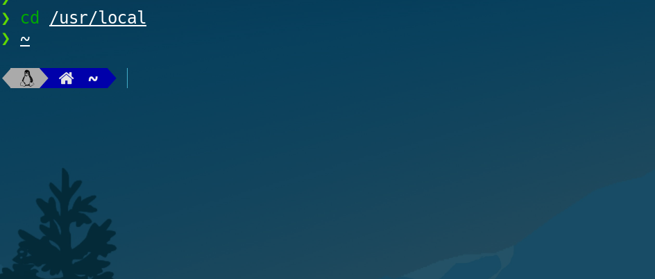
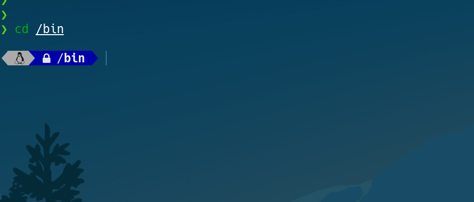
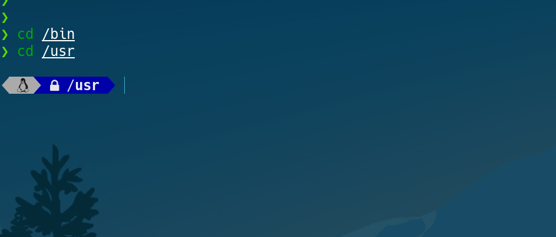
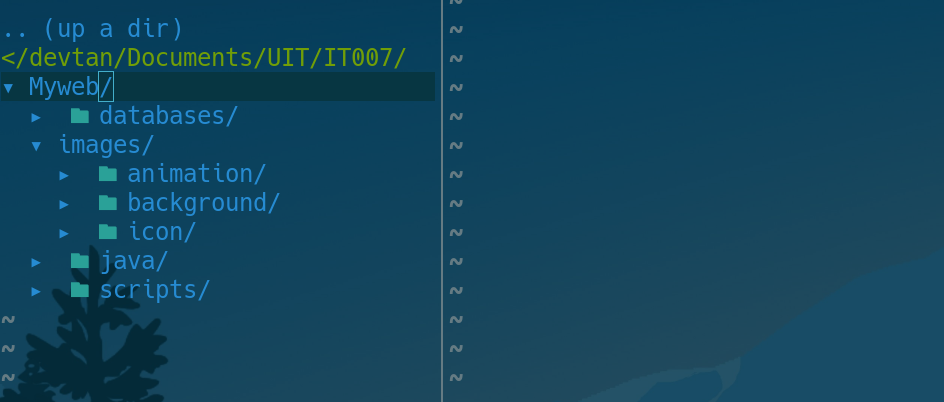
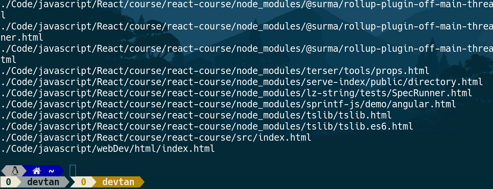
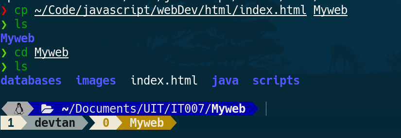
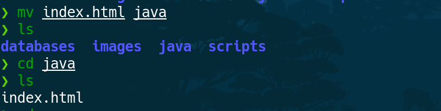
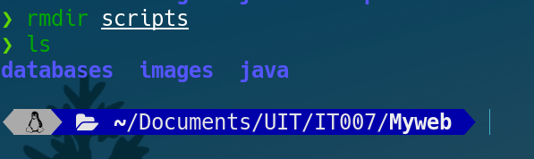
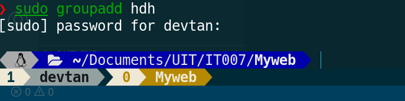
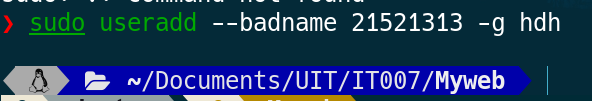

## 21521413 - Lab 01
#

1. Chuyển về thư mục gốc:

        ~

   Chuyển đến thư mục /bin

        cd /bin

Chuyển dến thư mục người dùng

        cd /usr

2. Tạo cây thư mục

        mkdir Myweb 
        cd Myweb
        mkdir images databases scripts java
        cd images
        mkdir icon background animation

        

3.
    Tìm files với extension

        find . -type f \( -name "*.html" -o -name "*.class" \)

Copy file đuôi html đến thư mục Myweb
        
        cp ~/Code/javascript/webDev/html/index.html Myweb

Di chuyển file từ thư mục Myweb đến Myweb/java

        mv index.html java

5. Thực hiện xóa thư mục Myweb/scripts

        rmdir scripts

6. Thiết lập quyền truy xuất cho thư mục Myweb/databases

        chmod 700 databases/

7. Tạo group hdh

        sudo groupadd hdh

Tạo user

        sudo useradd --badname 21521413 -g hdh

